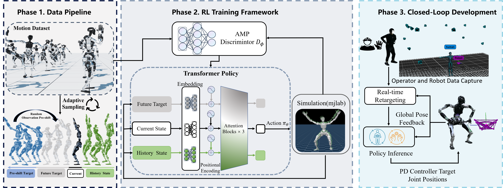

<br>
<p align="center">
<h1 align="center"><strong>CLOT: Closed-Loop Global Motion Tracking for Whole-Body Humanoid Teleoperation</strong></h1>
  <p align="center">
    <a href="https://scholar.google.com/citations?user=V7BopvYAAAAJ&hl=en&oi=ao" target="_blank">Tengjie Zhu</a><sup>1,2,*</sup>,
    <a href="#" target="_blank">Guanyu Cai</a><sup>1,*</sup>,
    <a href="#" target="_blank">Zhaohui Yang</a><sup>1,*</sup>,
    <a href="#" target="_blank">Guanzhu Ren</a><sup>1</sup>,
    <a href="#" target="_blank">Haohui Xie</a><sup>1</sup>,
    <a href="#" target="_blank">Junsong Wu</a><sup>1</sup>,
    <a href="#" target="_blank">ZiRui Wang</a><sup>2</sup>,
    <a href="https://wangjingbo1219.github.io/" target="_blank">Jingbo Wang</a><sup>2</sup>,
    <a href="https://scholar.google.com/citations?user=yDEavdMAAAAJ&hl=en" target="_blank">Xiaokang Yang</a><sup>1</sup>,
    <a href="https://yaomarkmu.github.io/" target="_blank">Yao Mu</a><sup>1,2,&dagger;</sup>,
    <a href="https://daodaofr.github.io/" target="_blank">Yichao Yan</a><sup>1,&dagger;</sup>
    <br>
    * Equal Contribution  &dagger; Corresponding Author
    <br>
    <sup>1</sup>MoE Key Lab of Artificial Intelligence, AI Institute, Shanghai Jiao Tong University  
    <sup>2</sup>Shanghai AI Laboratory
  </p>
</p>

<div id="top" align="center">

[](https://arxiv.org/abs/2602.15060)
[](https://zhutengjie.github.io/CLOT.github.io/)

</div>

## Pipeline

[]()


## News
- \[2026-02\] We release the code and paper for CLOT.


## About

This is the official implementation of the paper [CLOT: Closed-Loop Global Motion Tracking for Whole-Body Humanoid Teleoperation](https://zhutengjie.github.io/CLOT.github.io/).

Our paper offers a general-purpose action tracking strategy within a global closed-loop framework, together with a large-scale human motion dataset.

This repository includes:
- Multi-simulator support
  - Support multiple simulators including IsaacGym, IsaacSim, and MjLab (with MjLab as a primary simulator).
- Efficient RL training
  - Support multi-GPU parallel training for large-scale experiments.
- AMP-based rewards
  - Implementation of AMP-style discriminator rewards for motion imitation policies.

Below are the installation and usage instructions for the code in the mjlab environment.


## Install
We provide a lightweight environment setup method. 
We test the code in the following environment:
- **OS**: Ubuntu 22.04
- **GPU**: NVIDIA RTX 4090, Driver Version: 575.64.03
```bash
conda create -n clot python=3.11

pip install warp-lang --extra-index-url https://pypi.nvidia.com/
pip install "mujoco-warp @ git+https://github.com/google-deepmind/mujoco_warp@502556df5e44d79d6bdaa64361669602b5a206cf"

pip install -e .
```

## Data
We have currently uploaded about 10 hours of data to Hugging Face, including BVH files (with the coordinate system converted to Z-up and X-forward), as well as motion data retargeted to Adam Pro and G1 (following the [ASAP](https://github.com/LeCAR-Lab/ASAP) format). We also provide the corresponding **checkpoints** for Adam Pro and G1 in this repository.
```bash
git lfs install
git clone https://huggingface.co/datasets/Zhutengjie/human_motion
```
## Test

If you want to test the checkpoints in the mjlab environment:
```bash
# for Adam Pro
python humanoidverse/eval_agent.py +checkpoint=human_motion/adam_result/adam.pt
# for G1
python humanoidverse/eval_agent.py +checkpoint=human_motion/G1_result/g1.pt
```
If you want to deploy in the MuJoCo environment:
```bash
# for Adam Pro
python humanoidverse/urci.py +opt=record +simulator=mujoco +checkpoint=human_motion/adam_result/exported/adam.onnx

# for G1
python humanoidverse/urci.py +opt=record +simulator=mujoco +checkpoint=human_motion/G1_result/exported/g1.onnx
```
## Train

By default, training is conducted on 8 × 48GB RTX 4090 GPUs.
```bash
# for Adam Pro
sh train_adam_multi.sh

# for G1
sh train_g1_multi.sh
```
If you want to change the number of GPUs used for training, please modify `ngpu` in `humanoidverse/config/base/fabric.yaml` and `nproc_per_node` in the corresponding `.sh` script.
## Citation

If you find our work helpful, please cite:

```bibtex
@misc{zhu2026clotclosedloopglobalmotion,
      title={CLOT: Closed-Loop Global Motion Tracking for Whole-Body Humanoid Teleoperation}, 
      author={Tengjie Zhu and Guanyu Cai and Yang Zhaohui and Guanzhu Ren and Haohui Xie and ZiRui Wang and Junsong Wu and Jingbo Wang and Xiaokang Yang and Yao Mu and Yichao Yan and Yichao Yan},
      year={2026},
      eprint={2602.15060},
      archivePrefix={arXiv},
      primaryClass={cs.RO},
      url={https://arxiv.org/abs/2602.15060}, 
}
```


## License

This codebase is under [CC BY-NC 4.0 license](https://creativecommons.org/licenses/by-nc/4.0/deed.en). You may not use the material for commercial purposes, e.g., to make demos to advertise your commercial products.

## Acknowledgements

Our code builds upon and references the following excellent works. We sincerely thank the authors for their open-source contributions:

- **[ASAP](https://github.com/LeCAR-Lab/ASAP)** 
- **[PBHC](https://github.com/TeleHuman/PBHC)** 
- **[BeyondMimic](https://github.com/HybridRobotics/whole_body_tracking)** 
- **[mjlab](https://github.com/mujocolab/mjlab)** 
- **[ProtoMotions](https://github.com/NVlabs/ProtoMotions)**
- **[AMP](https://github.com/nv-tlabs/ASE)**

We would like to sincerely thank PNDbotics for providing
the robotic platform and comprehensive support related to the
robot hardware. We also thank Baidu for providing the GPU
resources.

## Contact

Feel free to open an issue or discussion if you encounter any problems or have questions about this project.

For collaborations, feedback, or further inquiries, please reach out to:

- Tengjie Zhu: [zhutengjie@sjtu.edu.cn](mailto:zhutengjie@sjtu.edu.cn) or Weixin `sy_my_treasure`
- Guanyu Cai: [caig3822@gmail.com](mailto:caig3822@gmail.com) or Weixin `wxid_2ak1wex0t2ft22`
- Zhaohui Yang: [yzh_academic@163.com](mailto:yzh_academic@163.com) or WeChat `windyy_wechat`
- You can also join our weixin discussion group for timely Q&A. Since the group already exceeds 200 members, you'll need to first add one of the authors on Weixin to receive an invitation to join.


We welcome contributions and are happy to support the community in building upon this work!
